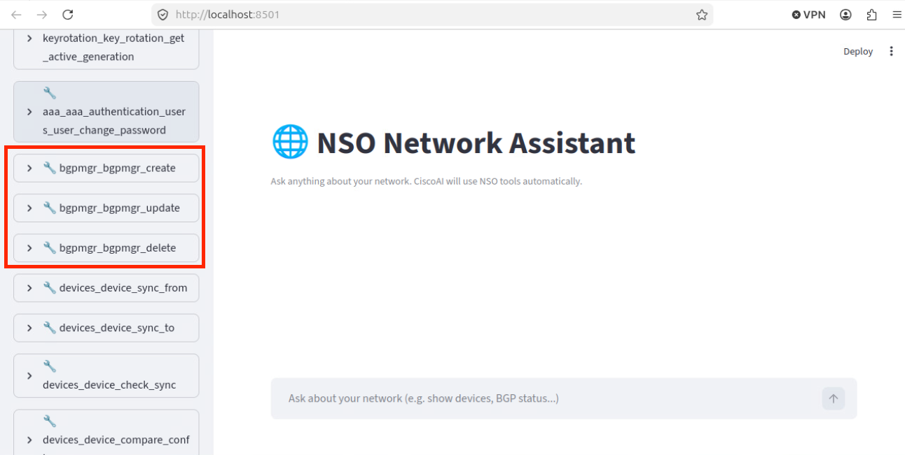
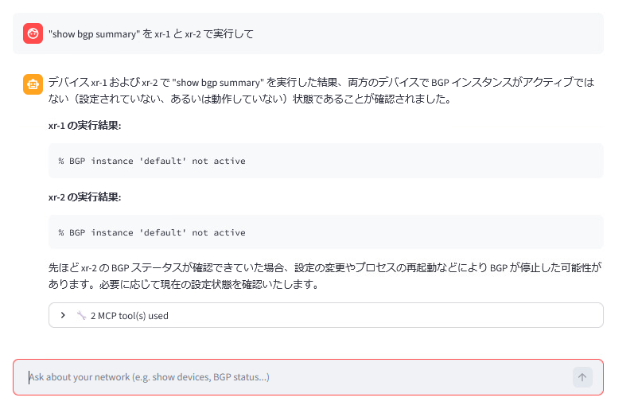
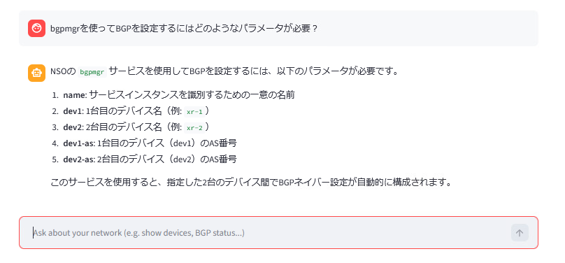
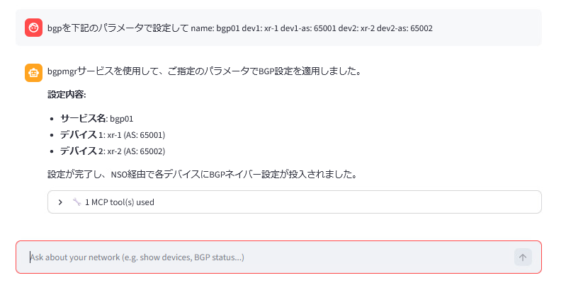
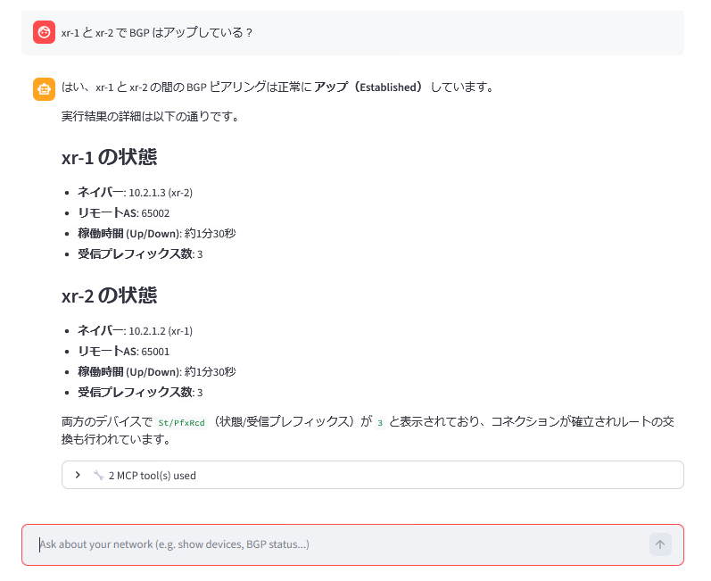

# NSO MCP — サービスモデルとBGP

!!! info "この前のラボからの続き"
    ここまでのラボでは、**permit**ポリシーを通じてNSO MCPを公開し、<http://198.18.134.27:8501/> で**Web MCPクライアント**を実行したところで終了しました。このラボでは、実際の**サービスパッケージ** (`bgpmgr`) を同じMCPクライアントに組み込み、自然言語を使用して**xr-1**と**xr-2**間で**BGP**を設定します。その後、2つ目のMCPクライアントを使用して内部の仕組みを確認します。

## 学習目標

このラボを完了すると、以下のことができるようになります。

- カスタムNSOサービスパッケージ (`dcloud-bgpmgr`) をクローンおよびコンパイルし、`packages reload` を介してロードする。
- **Refresh Tools**を押した後、パッケージのツールがMCP Webクライアントに表示されることを確認する。
- MCPクライアントを使用して、BGPサービスに**どのようなパラメータ**が必要かを尋ね、設定を**適用**する。
- MCPを通じてBGPネイバーのステータスを確認する（デバイスCLIで直接 `show bgp` を実行する必要はありません）。
- CPU専用の **`ollmcp`** MCPクライアントを起動し、`/t` と `/prompts` を介してNSOの**ツール**と**プロンプト**をリストアップする。

## 前提条件

- [ ] [NSO MCP のセットアップ](01-setup-mcp.md) を完了していること。
<!-- lint-allow-hardcoded-version -->
- [ ] NSO 6.7 LTSが実行されており、MCPサーバーが**enabled**（有効）で、**ポリシーのdefault-actionが `permit`** になっていること（Webクライアントで100個以上のツールが表示されていること）。
- [ ] Web MCPクライアントが <http://198.18.134.27:8501/> で到達可能であること。
- [ ] **xr-1** と **xr-2** の両方が `sync-from: true` の状態であること。

## 手順

### ステップ 1: `bgpmgr` サービスパッケージをクローンしてコンパイルする

Github から bgpmgr パッケージをクローンし NSO にインストールします。
サービスパッケージをロードすると、NSO MCPに追加のツールが自動的に追加されます。

下記の作業を Linux の CLI から実施します

```bash
cd
cd ncs-run/packages
git clone https://github.com/hitakaha/dcloud-bgpmgr.git
```

パッケージをコンパイルします。

```bash
cd dcloud-bgpmgr/src
make clean
make
```

### ステップ 2: パッケージをNSOにロードする

NSO CLIで以下を実行します。

```text
$ ncs_cli -Cu admin
admin@ncs# packages reload
```

リロードが完了するまで待ちます。

### ステップ 3: MCP Webクライアントに `bgpmgr` ツールが表示されることを確認する

**web-ui** (<http://198.18.134.27:8501/>) に戻り、左側のメニューの **Refresh Tools** を押します。これで、コアのNSOツールと一緒に **`bgpmgr`** ツールがリスト表示されるはずです（かなり下の方になります）。



### ステップ 4: `xr-1` と `xr-2` の既存のBGP設定をクリアする

現在、両方のXRdルータには以前のラボのBGP設定が残っています。MCP経由で設定するためのクリーンな状態にするため、NSOを通じてこれを削除します。

```text
$ ncs_cli -Cu admin
admin@ncs# config t
admin@ncs(config)# devices device xr-1 config
admin@ncs(config-config)# no router bgp
admin@ncs(config-config)# top
admin@ncs(config)# devices device xr-2 config
admin@ncs(config-config)# no router bgp
admin@ncs(config-config)# commit
```

### ステップ 5: BGPネイバーが存在しないことを確認する — MCP経由

Web MCPクライアントで、BGPネイバーが存在しないことを確認するようアシスタントに依頼します。

> *"show bgp summary" を xr-1 と xr-2 で実行して*



### ステップ 6: `bgpmgr` に必要なパラメータをアシスタントに尋ねる

YANGモデルを直接読むことなく、MCPクライアントを使用してパッケージを使うことができます。

> *"bgpmgrを使ってBGPを設定するにはどのようなパラメータが必要？"*



### ステップ 7: アシスタントを通じて `xr-1` と `xr-2` 間にBGPを設定する

次に、先ほどリストアップされたパラメータを使用して、BGPを設定するようにアシスタントに依頼します。

> *"BGP を下記のパラメータで設定して name: bpg01 dev1: xr-1 dev1-as: 65001 dev2: xr-2 dev2-as: 65002"*

アシスタントは要求を適切な `bgpmgr` サービスの呼び出しに変換し、NSOを通じてコミットします。



### ステップ 8: BGPネイバーがアップしていることを確認する — MCP経由

同僚に尋ねるのと同じように、もう一度アシスタントに尋ねます。

> *"xr-1とxr-2 で BGP はアップしている？"*



### ステップ 9: `ollmcp` でMCPのツールとプロンプトを検査する

このシナリオには、Ollama向けの2つ目のMCPクライアント (`ollmcp`) が同梱されています。ここでは純粋に**分析**目的（NSO MCPが何を公開しているかをリストアップするため）に使用します。

新しいターミナルタブを開き、以下を実行します。

```bash
cd
cd NSO-6.7-LTS-free/ollmcp
source venv/bin/activate
ollmcp -j ollama-mcp-config.json
```

`ollmcp` のプロンプトで **`/t`** と入力し、現在MCPによって公開されているすべてのNSOツールをリストアップします。


**`/prompts`** と入力して、利用可能なすべてのMCPプロンプトをリストアップします。


このクライアントの詳細については、<https://github.com/jonigl/mcp-client-for-ollama> を参照してください。

!!! note "ollmcpのパフォーマンス"
    このシナリオのOllamaベースのMCPクライアントは**CPUのみ（GPUなし）**で実行されるため、非常に低速です。インタラクティブなアシスタントとしてではなく、分析・イントロスペクションツールとして扱ってください。

## 確認

ここまでの手順で、以下の状態になっているはずです。

- [ ] **`bgpmgr`** パッケージがコンパイルおよびロードされ、**Refresh Tools** の後にそのツールがMCP Webクライアントに表示されていること。
- [ ] **xr-1** / **xr-2** のBGP設定がエンドツーエンドで**MCPを通じて**作成されていること（手動で `router bgp` コンフィグを入力していないこと）。
- [ ] **xr-1** と **xr-2** 間のBGPネイバーが、MCPアシスタントによって **up / Established** として報告されていること。
- [ ] **`ollmcp`** が実行されており、NSOのツール (`/t`) とプロンプト (`/prompts`) をリストアップできること。

## トラブルシューティング

- **Refresh Toolsの後に `bgpmgr` ツールが表示されない** — NSO CLIで `packages reload` が正常に完了したことを確認します（`show packages package bgpmgr oper-status`）。その後、再度 **Refresh Tools** を押してください。
- **`make` によるパッケージのコンパイルが失敗する** — `~/ncs-run/packages/dcloud-bgpmgr/src/` ディレクトリ内にいること、およびシェルで `NSO-6.7/ncsrc` が読み込まれていること（sourceされていること）を確認してください。
- **MCPがデバイスに到達できない** — NSO CLIで `devices sync-from` を再確認し、デバイスのauthgroupが引き続き解決可能であることを確認してください。
- **アシスタントが拒否するか、空のプランを返す** — MCPポリシーが `restricted` に戻っている可能性があります。`mcp-server policies default-action permit` がコミットされていることを再確認してください。


## 次のステップ
ここまでのラボでは、自然言語でNSOを操作し、カスタムサービスパッケージを同じインターフェースに組み込む方法として **NSO 6.7 MCP** を紹介しました。次のラボでは **カスタム `mcp-server policies`** を学びます。

