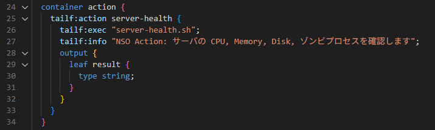
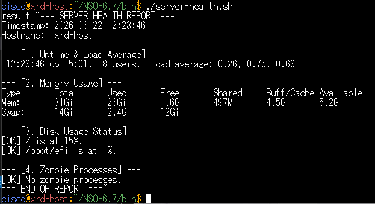
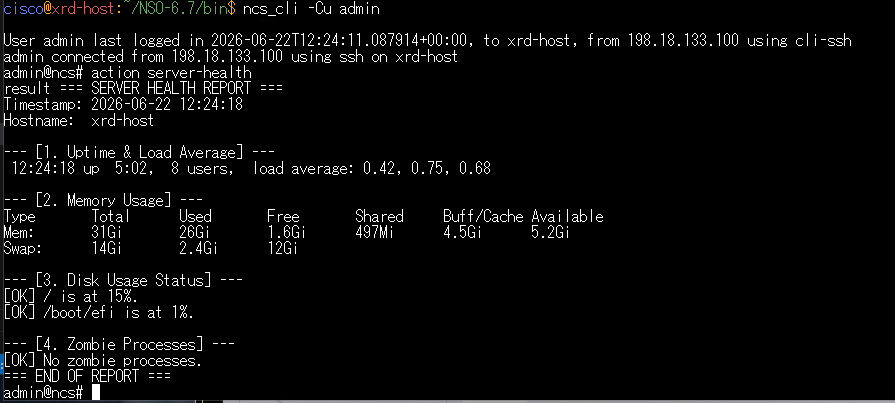
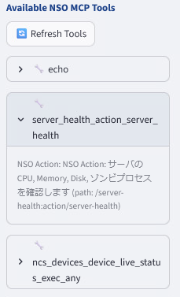
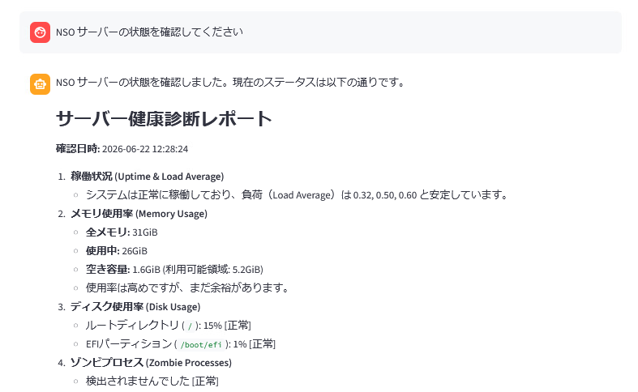

# 余裕のある方:アクション Tools の定義

!!! info "このシナリオはオプションです。余裕のある方はぜひ挑戦してみてください。"

## 学習目標

このラボを完了すると、以下のことができるようになります。

- カスタム Action を定義し、それを MCP Tools として利用できます
- Action スクリプトを編集し、NSO サーバの状態を自然言語で確認できるようになります

## 前提条件

- [ ] NSO のパッケージ作成方法を理解していること
- [ ] NSO の Action （コンフィグ設定ではなくコマンド実行）を理解していること
- [ ] NSO MCP ポリシーを理解していること


## カスタム Action の定義

NSO はデバイスのコンフィグを管理するオーケスとレーターです。
しかしコンフィグの設定管理だけでなく、show コマンドなどの実行も可能です。
NSO ではそうしたコマンドの実行を **Action** と呼びます。

詳しくは弊社カスタマーサクセスチームが実施したウェビナーおよび過去のハンズオンをご参照ください。

- [ATX録画と資料：NSO アクションによる事前事後確認の自動化と独自コマンドの定義](https://community.cisco.com/t5/-/-/ba-p/5266609?attachment-id=236011)
- [第五回 NSO サクセスコミュニティ (ユーザ会) の開催レポート ](https://community.cisco.com/t5/-/-/ta-p/5334663)


## カスタム Action パッケージの作成

Linux で下記のコマンドを実行しカスタムパッケージを作ります。

    cd 
    cd ncs-run/packages
    ncs-make-package --service-skeleton python --action-example server-health

次にパッケージの YANG を編集し、外部スクリプトを実行するようにします。
デスクトップにある VSCode を開くと自動で NSO サーバに接続しますので、
ncs-run/packages/server-health/src/yang にある server-health.yang を編集します。


以下のように変更します。
- 25 行目の Action 名 double を server-health に変更
- 26 行目の **tailf:actionpoint** を **tailf:exec** に変えスクリプト名 server-health.sh を指定
- 27-31 行の input は不要なので削除
- 34 行目 output の型を string にします
- 26 行目 tailf:exec の次の行に tailf:info を追加、MCP Tools としての description を記載します



その後 Linux で make します。

    cd server-health/src
    make


NSO にログインしパッケージリロードをします。

    ncs_cli -Cu admin
    packages reload


# 実行スクリプトの設置

VSCode で NSO-6.7/bin に server-health.sh という名前で下記のスクリプトを作成・保存します。

```bash
#!/usr/bin/bash

# すべての出力を一度変数に格納し、最後に一括で出力します
REPORT=$(cat << EOF
=== SERVER HEALTH REPORT ===
Timestamp: $(date '+%Y-%m-%d %H:%M:%S')
Hostname:  $(hostname)

--- [1. Uptime & Load Average] ---
$(uptime)

--- [2. Memory Usage] ---
$(free -h | awk '
  NR==1 {print "Type       Total      Used       Free       Shared     Buff/Cache Available"}
  NR==2 {printf "Mem:       %-10s %-10s %-10s %-10s %-10s %-10s\n", $2, $3, $4, $5, $6, $7}
  NR==3 {printf "Swap:      %-10s %-10s %-10s\n", $2, $3, $4}
')

--- [3. Disk Usage Status] ---
$(df -h | grep -E '^/dev/' | while read -r line; do
    usage=$(echo "$line" | awk '{print $5}' | sed 's/%//')
    mount=$(echo "$line" | awk '{print $6}')
    if [ "$usage" -ge 90 ]; then
        echo "[CRITICAL] $mount is at ${usage}%! Details: $line"
    elif [ "$usage" -ge 80 ]; then
        echo "[WARNING] $mount is at ${usage}%. Details: $line"
    else
        echo "[OK] $mount is at ${usage}%."
    fi
done)

--- [4. Zombie Processes] ---
$(zombies=$(ps aux | awk '{if ($8 == "Z") print $0}' | wc -l)
if [ "$zombies" -gt 0 ]; then
    echo "[WARNING] $zombies zombie process(es) detected."
else
    echo "[OK] No zombie processes."
fi)
=== END OF REPORT ===
EOF
)

# MCP Toolのテキスト出力として、1つの文字列（result）に流し込める形式で出力
echo result '"'"$REPORT"'"'
```

その後 Linux で実行属性をつけます。

    cd
    cd NSO-6.7/bin
    chmod +x server-health.sh

スクリプトを実行し、サーバの情報が出力されることを確認します。

    



# MCP で動作確認


まず NSO からスクリプトが呼べることを確認します。



次にこのパッケージを MCP Tools として公開します。
下記の設定を NSO で行います。

    config
    mcp-server policies rule 4 action permit
     match path /server-health:action/server-health


WebUI で **Refresh Tools** を実行し、server-health が使えるようになっていることを確認します。




実際に以下のように質問し、サーバの状態を MCP 経由で調べることができるか確認します。

> **NSOサーバの状態を確認してください**





!!! info "server-health パッケージは下記から clone して使うことも可能です。"
    [https://github.com/hitakaha/nso-server-health](https://github.com/hitakaha/nso-server-health)


## 確認

ここまでの手順で、以下の状態になっているはずです。

- [ ] **server-health** パッケージが正常に読み込まれていること
- [ ] WebUI 経由で NSO サーバの状態を確認できるようになっていること

## トラブルシューティング

- **WebUI が500 エラーになる** — API がタイムアウトしています。frontend, backend を両方とも ++ctrl+c++ で一度終了して再度起動してください

## 次のステップ

以上で NSO MCP ハンズオンは終了です。お疲れ様でした！ 

