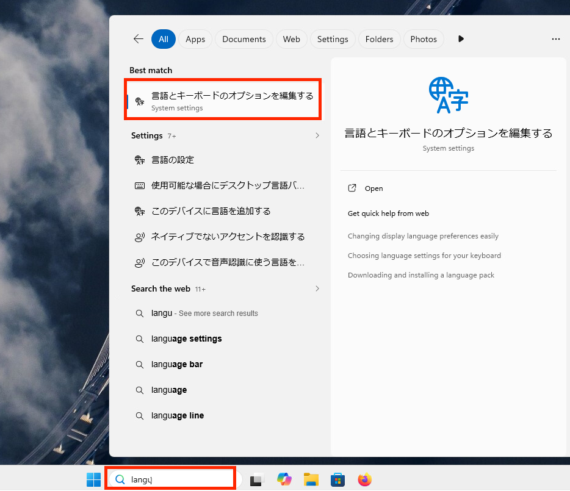
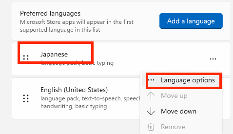
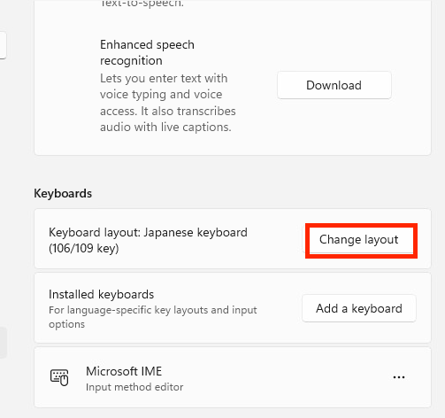
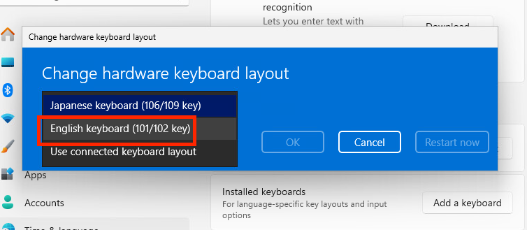
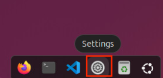
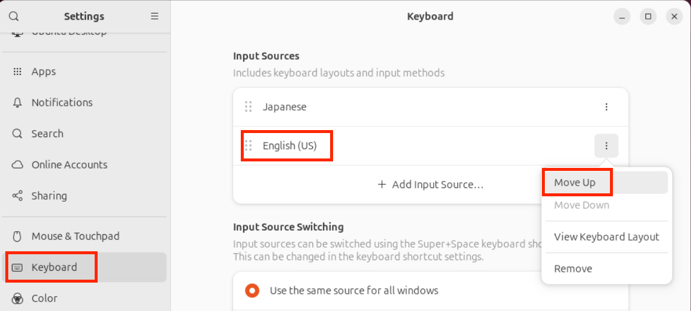

# 英語キーボードへの変更方法

今回のハンズオンで使用するシナリオは
キーボードが日本語 106/109 配列になっています。
英語配列をご希望の方は下記の方法で変更してください。

## Win11 での変更

Win11 でキーボードを変更するには下記のようにします。
まず検索に**language**と入力し、メニューから**言語とキーボードのオプションを編集する**を選択します。

その後 **Japanese**で**Language options**を選択します。

下の方にスクロールし **Change layout** を選択します。

**English keyboard (101/102 key)** を選択し再起動します。

!!! info "再起動してもシナリオには影響ありません"

## Ubuntu での変更

デスクトップ下部にある**Settings**を起動します。

左のメニューから**Keyboard**を選択、
中央の Input Sources で**English**を選び**Move Up**をします。

その後ウインドウを閉じ、再起動します。

!!! info "再起動してもシナリオには影響ありません"
