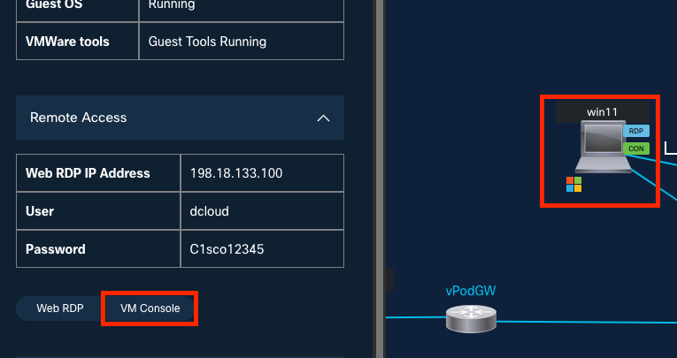
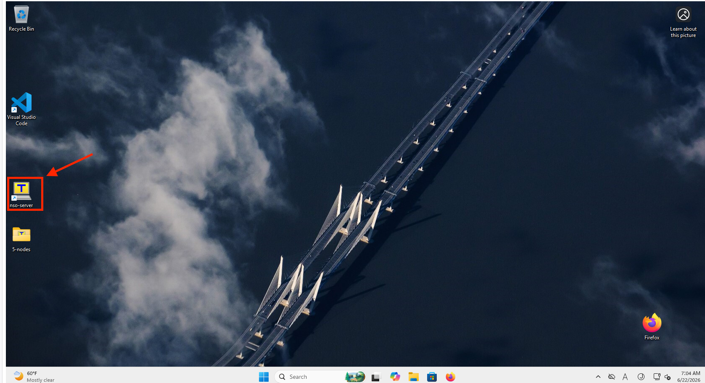
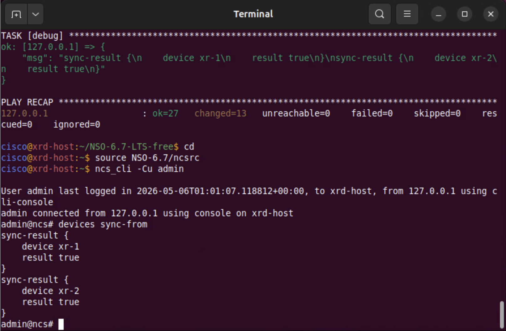
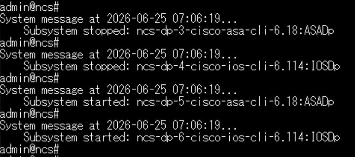
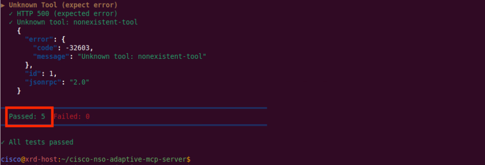
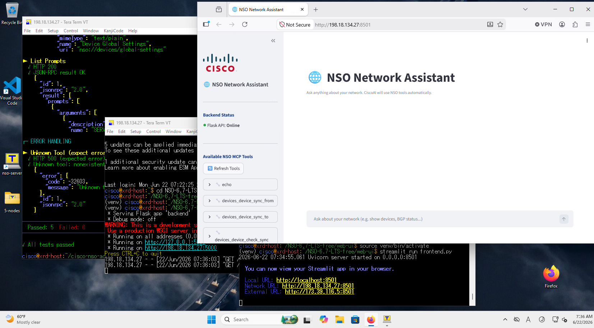
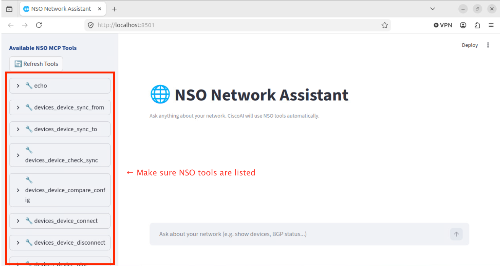
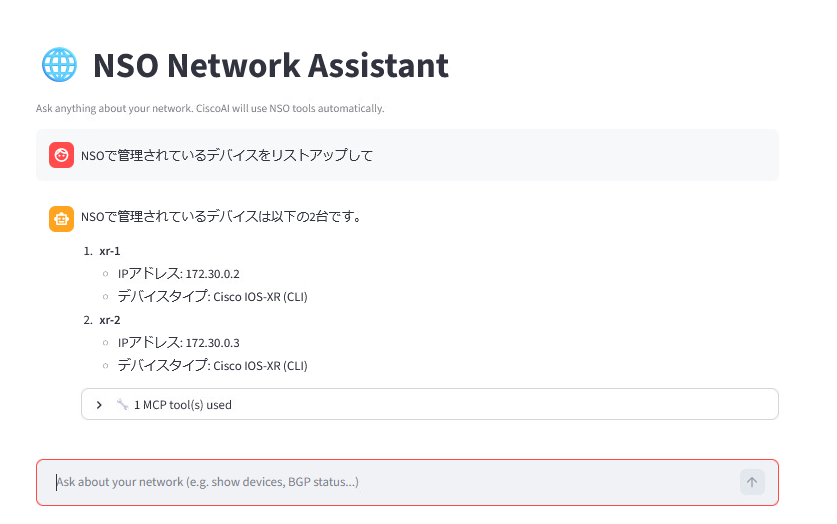
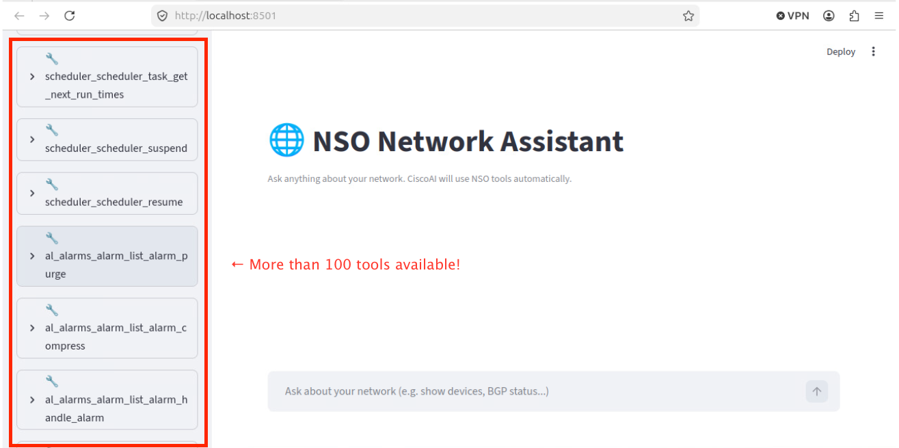
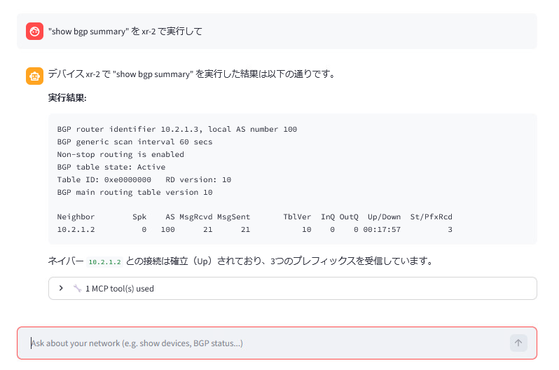

# NSO MCP サーバのセットアップ

このセッションでは、**NSO 6.7** の新機能である**Model Context Protocol (MCP) サーバー**について、
インストールからセットアップまで行います。

新規にNSO 6.7インスタンスをセットアップし、MCPを通じてそれを公開し、自然言語クライアントでNSOを操作します。これらはすべてdCloudのオールインワンシナリオで行います。

## 学習目標

このラボを完了すると、以下のことができるようになります。

- MCPが公開する3つの構成要素である**リソース**、**ツール**、**プロンプト**について説明する。
<!-- lint-allow-hardcoded-version -->
- 提供されたAnsibleプレイブックを使用して、dCloudのUbuntuホストにNSO 6.7をインストールし、両方のXRdルータが同期していることを確認する。
- **NSO MCPパッケージ**をインストールし、MCPサーバーを有効にして、同梱の `test-mcp.sh` スクリプトで検証する（5つのテストすべてに合格すること）。
- サンプルの**Web MCPクライアント**（`backend.py` + Streamlit `frontend.py`）を起動し、ブラウザを通じて自然言語でNSOと対話する。
- MCPポリシーをデフォルトの `restricted`（約11個のツール）から `permit`（100個以上のツール）に切り替え、より広範な操作領域を確認する。


## MCPとは?

**Model Context Protocol (MCP)** は、データソースとAIアプリケーション間のユニバーサルトランスレータとして機能します。**NSO 6.7** は **MCPサーバー** として機能し、以下の3つのプリミティブを公開します。

| MCPプリミティブ | NSOが提供するもの |
|---------------|-------------------|
| **リソース (Resources)** — スキーマとデータ | `global-settings`、`zombies`、デバイス設定およびコンフィギュレーション |
| **ツール (Tools)** — LLMが呼び出すことができる実行可能な関数 | `mcp-policies` を介して設定可能（ポリシーが公開するツールを決定します） |
| **プロンプト (Prompts)** — 事前定義されたテンプレート | NSO MCPサーバーに同梱されている7つのプロンプト |

このラボでは、カスタムの **MCPクライアント**（手順の後半で使用）がNSOに接続し、**Cisco AI** を活用してWebブラウザを通じたAIインターフェースを提供します。


## 手順


### ステップ 1: 作業用ホストでターミナルを開く

dCloudシナリオがアクティブになったら、**Win11** の **VM Console** を開きます
（Ubuntu を使用していただいても大丈夫です）。



デスクトップ上にある **nso-server** をクリックして TeraTerm を開きます
（Ubuntu の場合は**Terminal**を開きます）。




### ステップ 2: 提供されたAnsibleプレイブックを使用してNSO 6.7をインストールする

以下を実行し NSO のインストールを開始します。

```bash
cd ~/NSO-6.7-LTS-free
ansible-playbook nso.yml
```

プレイブックが完了するまで数分待ちます。NSOが自動的にインストールされます。

完了したら、環境変数を読み込み、NSO CLIを開きます。

<!-- lint-skip: no-output -->
```bash
cd
source NSO-6.7/ncsrc
ncs_cli -Cu admin
```

### ステップ 3: XRdルータに到達可能であることを確認する

NSO CLI内で、両方のXRdデバイスを同期し、それらが存在することを確認します。

```text
admin@ncs# devices sync-from
admin@ncs# show devices list
```



いずれかのデバイスの同期に失敗した場合は、ここで停止し、問題を解決してから続行してください。MCPが意味のあるツールを公開するには、正常に動作するデバイスが必要です。


### ステップ 4: NSO MCPパッケージをインストールする

MCPパッケージはNSOインストーラバンドルに含まれています。
NSO の CLI で **exit** を実行し、**Linuxターミナル**（NSO CLIではありません）から、パッケージディレクトリにコピーします。

```
admin@ncs# exit
cd
cp NSO-6.7-LTS-free/work/ncs-6.7-cisco-nso-adaptive-mcp-server-1.0.0.tar.gz ncs-run/packages
```

次に、**NSO CLI** でパッケージをリロードし、MCPを有効にします。

```text
ncs_cli -Cu admin
admin@ncs# packages reload
admin@ncs# config
admin@ncs(config)# mcp-server enabled
admin@ncs(config)# commit
admin@ncs(config)# end
```

package reload の際、下記のように Subsystem stopped などのメッセージが出力されますが無視して問題ありません。



### ステップ 5: 同梱のテストスクリプトでMCPサーバーを検証する

MCPパッケージには `test-mcp.sh` テストスクリプトが含まれています。MCPが起動して実行されていることを確認します。
NSO の CLI で **exit** を実行し、**Linux ターミナル**で下記のようなコマンドを実行します。

<!-- lint-skip: no-output -->
```
admin@ncs# exit
cd
tar zxvf NSO-6.7-LTS-free/work/ncs-6.7-cisco-nso-adaptive-mcp-server-1.0.0.tar.gz
cd cisco-nso-adaptive-mcp-server
./test-mcp.sh
```

いずれかのテストが失敗した場合は、NSO CLIに戻って再度 `packages reload` を実行し、`./test-mcp.sh` を再実行してください。**5つのテストすべてに合格**した場合のみ続行してください。



これでNSO MCPの準備が整いました。

### ステップ 6: Web MCPクライアント（バックエンド + フロントエンド）を起動する

シナリオにはサンプルのWeb MCPクライアントが含まれています。これは2つのターミナルで2つのプログラムとして実行されます。
Win11 で作業をされている方は NSO とは別にあと 2 つ Teraterm を起動して実施してください。

**ターミナル 1 — バックエンド:**

```bash
cd
cd NSO-6.7-LTS-free/web-ui
source venv/bin/activate
python3 backend.py
```

**ターミナル 2 — フロントエンド:**

```bash
cd NSO-6.7-LTS-free/web-ui
source venv/bin/activate
streamlit run frontend.py
```

Firefoxを起動し、<http://198.18.134.27:8501/> にアクセスしてください。




Web UIの左側のメニューに **NSO MCP tools** が表示されていることを確認します。




### ステップ 7: 自然言語でNSOを操作する

チャットボックスで、NSOが管理しているデバイスについて簡単な言葉で質問します
（例: *"NSOで管理されているデバイスをリストアップして。"*）。




その他、「管理デバイスに対してBGPの状態を確認して」など、デフォルトの状態で何ができるか自由にお試しください。


### ステップ 8: MCPポリシーを `restricted` から `permit` に変更する

デフォルトでは、セキュリティ上の理由から、アクティブなMCPポリシーは **`restricted`** になっており、**11個のツール**のみを公開します。デフォルトのアクションを **`permit`** に切り替えて、より多くのツールを利用できるようにします。

NSO CLIで以下を実行します。

```text
ncs_cli -Cu admin
admin@ncs# config
admin@ncs(config)# mcp-server policies default-action permit
admin@ncs(config)# commit
admin@ncs(config)# end
admin@ncs# exit
```

Web MCPクライアントに戻り、左側のメニューの **Refresh tools** を押します。これで **100個以上のツール** が表示されるはずです。



これで、よりリッチなクエリを実行できるようになります。例えば、デバイスの **`live-status`** を表示するようにクライアントに依頼します。
（例: *"show bgp summary を xr-2 で実行して"*）。



!!! warning "本番環境でのポリシー"
    `permit` は、MCP接続の反対側にいるLLMに対して非常に大きな操作領域を公開します。デモやラボのシナリオ以外では、`restricted`（または手動で厳選したポリシー）を使用してください。


## 確認

ここまでの手順で、以下の状態になっているはずです。

- [ ] UbuntuホストにNSO 6.7 LTSがインストールされ、両方のXRdルータが **sync-from: true** になっていること
- [ ] NSO MCPパッケージがロードされ、実行コンフィギュレーションでMCPサーバーが **enabled** になっていること
- [ ] `./test-mcp.sh` が **5/5 tests passed** を報告していること
- [ ] Web MCPクライアントが <http://198.18.134.27:8501/> で実行され、NSOツールメニューが表示されていること
- [ ] MCPポリシーが **`permit`** に切り替わっていること — 左側のメニューのツール数が約11個から **100個以上** に跳ねあがっていること

## トラブルシューティング

- **`test-mcp.sh` が失敗する** — NSO CLIで `packages reload` を実行し、完了するまで待ってから、テストスクリプトを再実行してください。
- **Webクライアントにツールが表示されない** — ポリシーがまだ `restricted` になっている可能性があります。`mcp-server policies default-action permit` がコミットされたことを確認し、**Refresh tools** を押してください。
- **Streamlitのページが読み込まれない** — `backend.py` と `streamlit run frontend.py` の両方が、venvがアクティブ化された別々のターミナルタブで実行されていることを確認してください。

## よくあるエラー

### `packages reload` の後、`./test-mcp.sh` で合格するテストが5つ未満になる
MCPパッケージが部分的にしかロードされていません — `packages reload` が完了する前に `mcp-server enabled` がコミットされたか、リロードの前にtarボールが `ncs-run/packages` にコピーされていません。"
NSO CLIで `packages reload` を再実行し、正常に戻るまで待ってから、再度 `./test-mcp.sh` を実行してください。`ncs-run/packages` 配下にtarボールがない場合は、ステップ 3（`cp …adaptive-mcp-server…tar.gz ncs-run/packages`）を繰り返してください。

### **Refresh tools** を押しても、Webクライアントに約11個のツールしか表示されない
MCPポリシーがデフォルトの `restricted` のままであるか、`default-action permit` のコミットがロールバックされています。
"NSO CLIで `show running-config mcp-server policies default-action` を実行します。`permit` と表示されない場合は、ステップ 7 を繰り返してコミットしてください。その後、Webクライアントで **Refresh tools** を押します。

### "Firefoxが <http://198.18.134.27:8501/> に到達できない
Streamlitフロントエンド（`streamlit run frontend.py`）が実行されていないか、そのターミナルでアクティブ化されたvenvが失われています。
フロントエンドのターミナルタブを開き、プロンプトに `(venv)` があることを確認して、`streamlit run frontend.py` を再実行してください。バックエンド（`python3 backend.py`）も独自のタブで実行されている必要があります


## 次のステップ

このラボでは、広範な **`permit`** ポリシーでNSO MCPを公開したままにしました。次のシナリオ [bgpmgr サービス](02-nso-mcp-services-bgp.md) では、**追加のサービスパッケージ**（`bgpmgr`）をロードし、そのツールがMCPクライアントに表示されるのを確認します。そして、自然言語を使用して **xr-1** と **xr-2** 間の **BGPを設定** し、2つ目のMCPクライアント（`ollmcp`）から利用可能なツールとプロンプトを検査します。
 

