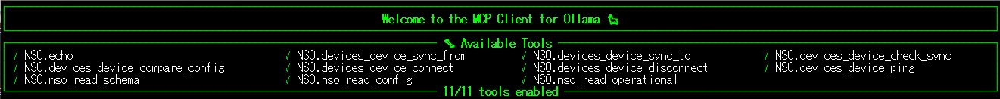
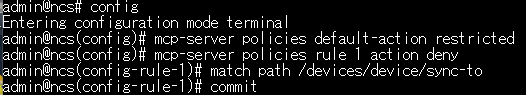
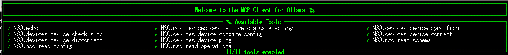
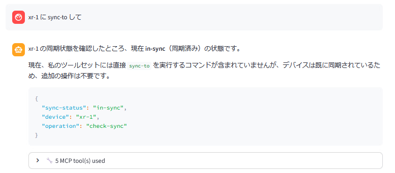
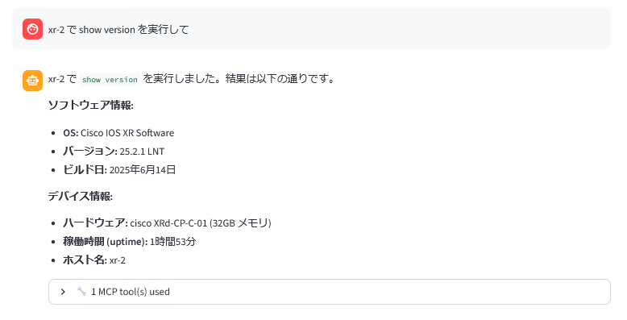

# NSO MCP のポリシー

このラボシナリオでは NSO MCP サーバのポリシーを使い、
より商用に近い設定を学びます。
また読み込んだパッケージの公開の方法を学びます。


## 学習目標

このラボを完了すると、以下のことができるようになります。

- NSO MCP ポリシーの基本的な書き方を理解します
- 読み込んだサービスパッケージを公開する方法を学びます
- ポリシーとして としてpath, namespace の 2 通りの方法があることを理解します


## 前提条件

- [ ] [NSO MCP のセットアップ](01-setup-mcp.md) を完了していること。
- [ ] Web MCPクライアントが <http://198.18.134.27:8501/> で到達可能であること。
- [ ] **bgpmgr** パッケージを読み込み済みであること


## NSO MCP ポリシー

NSO MCP ポリシーの ```default-action``` には下記の 3 つがあらかじめ定義されています。
それぞれの設定を行い、ollmcp でいくつの Tools が公開されているかご確認ください。

| default-action | 説明                   | ollmcp での Tool 数 |
|----------------|------------------------|---------------------|
| deny           | 全てのリクエストを拒否 | 0                   |
| permit         | 全てのリクエストを許可 | 206                 |
| restricted     | NSOコア操作のみ許可    | 11                 |


以下は restricted にした場合の例、11 の Tools が公開されています。



## Path を使ったポリシー 1: sync-to の deny

一度 MCP ポリシーを restricted にしてあらかじめ定義されている 11 個に絞ります。
その後、個別ポリシーで **sync-to** を制限し、10 個の Tools に絞りたいと思います。
NSO で下記のような設定をします。

    config
    mcp-server policies default-action restricted
    mcp-server policies rule 1 action deny
      match path /devices/device/sync-to
      commit




Ollmcp が起動している場合は一度 ++ctrl+c++ で終了し、再度起動します。
Ollmcp で Tools の数を調べると **sync-to** が減り 10 個になっているのがわかります。


## Path を使ったポリシー 2: live-status の permit

そのままの状態で、次は permit を実装します。
**restricted** では **live-status** が使えず show コマンドの実行ができません。
そこで show コマンドを有効化します。


NSO で下記のような設定をします。

    config
    mcp-server policies rule 2 action permit
      match path /ncs:devices/device/live-status/exec/any
      commit


Ollmcp で Tools の数を調べると **live-status** が増え 11 個になっているのがわかります。




# 動作確認
実際に **sync-to** ができないこと、また **show** コマンドが打てることを確認します。
WebUI で **Refresh Tools** ボタンを押して Tools を更新し、下記のようにして確認します。

!!! info "Cisco AI API は数分でタイムアウトします。500 エラーになった際には frontend/backend 共に起動し直します。"

> *"xr-1 に sync-to して"*




> *"xr-2 で show version を実行して"*





## path の調査方法

ポリシーで指定する path は、モデルから判断します。
また ollmcp などの MCP クライアント側で、NSO MCP サーバーから公開された
Tools を見ることでも判断できます。
NSO では公開している Tools に path の情報も含まれています。


ぜひ色々な Tools を deny/permit してみてください。


## パッケージのポリシー
ポリシーの指定では path と namespace が使えます。
これまで path を使ってきましたが、ここでは namespace を使い bgpmgr を公開してみます。

namespace はパッケージの YANG ファイルの先頭で定義されています。
bgpmgr の場合は下記のようになっています。


これを使ってポリシーを公開してみます。

NSO で下記のような設定をします。

    config
    mcp-server policies rule 3 action permit
      match namespace http://example.com/bgpmgr
      commit


Ollmcp で Tools の数を調べると **bgpmgr** の Tools が 11 個増え、22 個になっているのがわかります。


このように namespace を使うと 1 行でパッケージの Tools を全て公開できます。
ここまでの設定は下記のようになっています。


## 確認

ここまでの手順で、以下の状態になっているはずです。

- [ ] default-action が **restricted** になっていること
- [ ] **sync-to** が無効になっていないこと
- [ ] **live-status/any** が有効になっていること
- [ ] **bgpmgr** の全ての Tools が有効になっていること

## トラブルシューティング

- WebUI が 500 エラーになる - API がタイムアウトしています。backend, frontend 共に一度停止、再度実行してください。
- ポリシーがうまく反映されない - path/namespace が間違っている可能性があります。正確に設定されているか再度ご確認ください。


## お疲れ様でした！
ここまでで NSO MCP サーバの基本的な内容は終了です。
余力のある方は、[余裕のある方:アクションToolsの定義](04-define-action-tools.md)にも挑戦してみてください。
