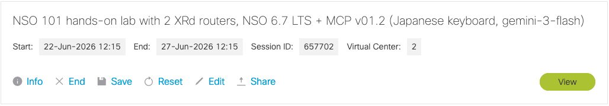
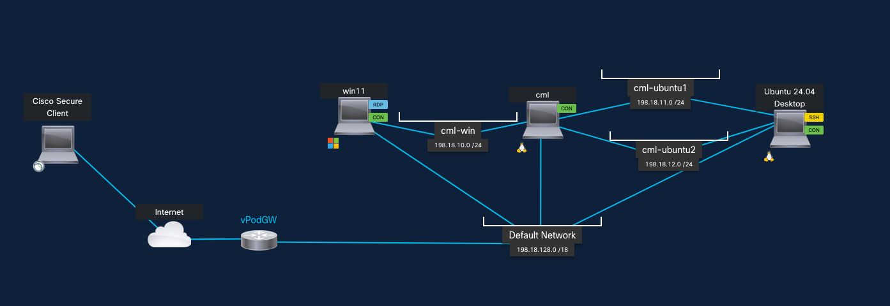
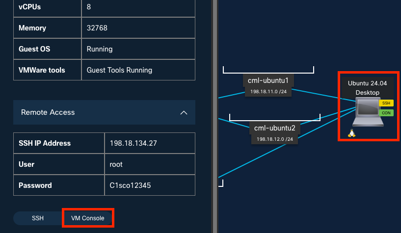

# NSO 6.7 MCP ハンズオン

このハンズオンでは NSO 6.7 で実装された MCP サーバについて
ハンズオンを通して理解を深めていただくことを目的としています。

## MCP とは
MCP については下記に簡単にまとめてありますので
必要に応じてご参照ください。

## dCloud について
このハンズオンでは dCloud を使います。 

[dCloud へのアクセスはこちら](https://dcloud2-sng.cisco.com/dashboard/sessions)

各自下記のようなシナリオが割り当てられていますので、View ボタンを押してアクセスしてください。
シナリオが割り当てられていない方はお近くの社員までお声がけください。

## トポロジー
このハンズオンは下記のようなトポロジーで構成されています。

作業用のマシンとして Windows 11 と Ubuntu 24.04 を用意しています。
どちらか使いやすい方をご利用ください。

### Windows 11 をご利用の場合
トポロジーから win11 を選択し VM Console を使ってアクセスしてください。
ユーザ名・パスワードは不要です。
デスクトップ上の teraterm をクリックいただくと 
NSO Ubuntu 24.04 へアクセスできます（SSH キー登録済みのためユーザ名・パスワード不要）。

### Ubuntu をご利用の場合
トポロジーから Ubuntu 24.04 を選択し VM Console を使ってアクセスしてください。
この Ubuntu サーバに NSO をインストールして使用します。

